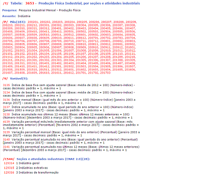
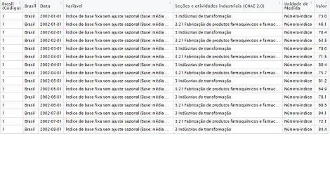
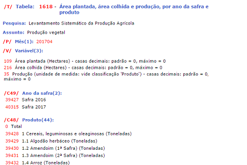
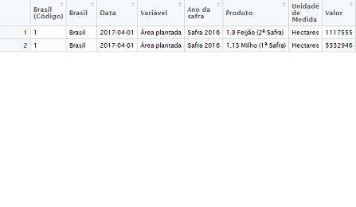

```{r setup, include=FALSE}
knitr::opts_chunk$set(echo = TRUE)
```


## Descrição dos parâmetros

 * <b>x:</b> Número da série
 
 * <b>from:</b> String ou vetor de caracter specificando a data de início da série (padrão é 1980)
 
 * <b>to:</b> String ou vetor de caracter specificando a data de fim da série (padrão é ano atual)
  
 * <b>territory:</b> Especifica o nível territorial da pesquisa
 
 * <b>variable:</b> Um valor com o código da variável desejada (padrão é selecionar todas as existentes)
 
 * <b>cl:</b> Vetor contendo as classificações desejadas
 
 * <b>sections:</b> Vetor ou lista de vetores (se houver mais de duas classificações) contendo as tabelas desejadas


## Pesquisa Industrial Mensal - Produção Física


```{r sidra2}
sidra=ecoseries::series_sidra(x = c(3653), from = c("200201"), 
                   to = c("201512"), territory = "brazil", 
                   variable = 3135, sections = c(129316,129330),
                   cl = 544)
```

{.classname}
{.classname}


## Sistema de Produção Agrícola

```{r sidra3}
sidra=ecoseries::series_sidra(x = c(1618), from = c("201704"), to = c("201704"), 
                   territory = "brazil", variable = 109, sections=list(c(39427),
                                                                       c(39437,39441)), 
                   cl = c(49, 48))
```


{.classname}
{.classname}


## Contas Nacionais Trimestrais


```{r sidra4}
sidra = ecoseries::series_sidra(x = 1620, from = 199001, to = 201701,  territory = "brazil",
                     sections=list(c(90687)), cl =c(11255), variable = 583)

print(sidra$serie_1620)
```


## Formato Output


* Sidra devolve lista de strings

* As colunas de data e valor são transformadas em objetos 'Date' e 'numeric', respectivamente

<br>
<br>


```{r sidra5}
str(sidra$serie_1620$Data)
str(sidra$serie_1620$Valor)

```